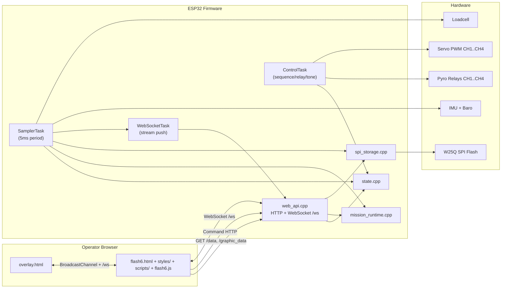
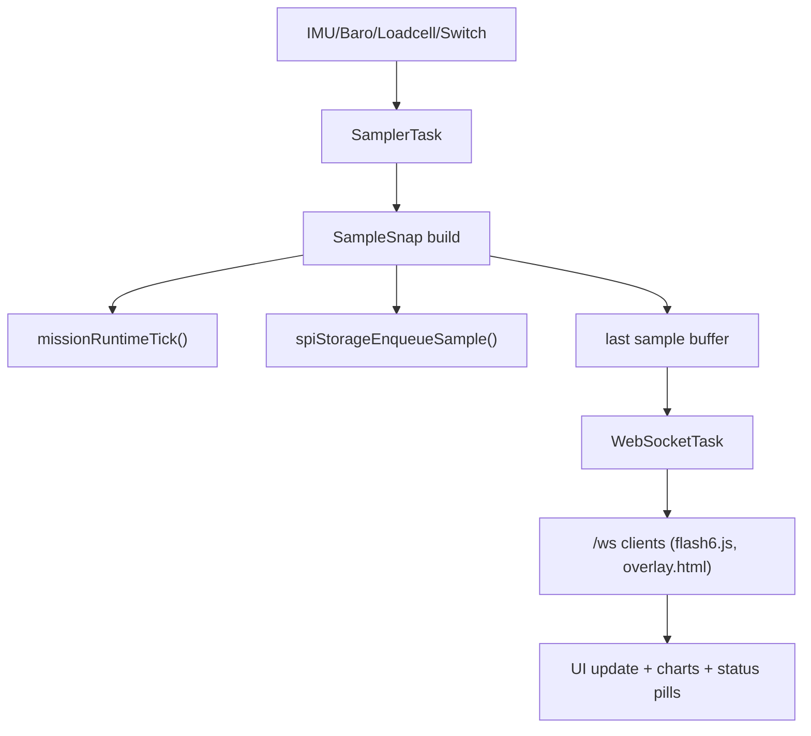
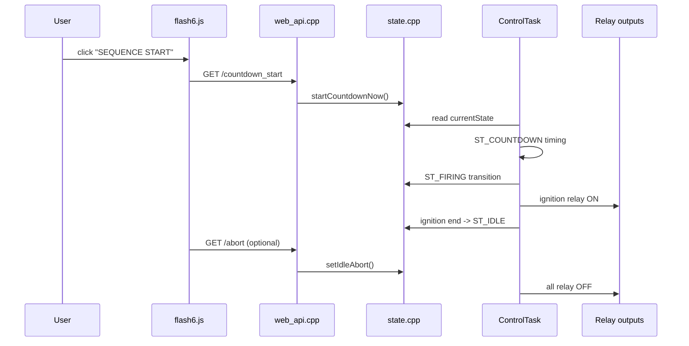
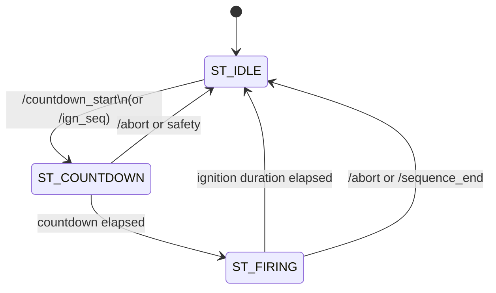
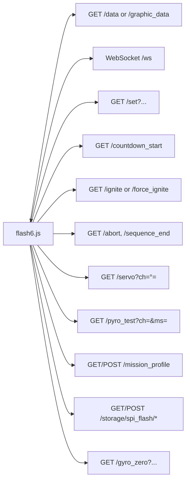

# FLASH6 Program Diagram

This document summarizes the current `flash6` program structure (external UI + firmware API integration) as Mermaid diagrams.

## 1) System Architecture

## 2) Runtime Data Flow (Telemetry)

## 3) Command / Control Path

## 4) Firmware State Machine (Sequence Core)

## 5) Main HTTP/WS Interfaces Used by flash6

## Source Anchors

- UI: `flash6/flash6.html`, `flash6/flash6.js`, `flash6/overlay.html`
- API routes: `src/web_api.cpp` (`server.on(...)` and `AsyncWebSocket ws("/ws")`)
- Runtime tasks: `src/tasks.cpp` (`SamplerTask`, `ControlTask`, `WebSocketTask`, `startTasks`)
- State and mission: `src/state.cpp`, `src/mission_runtime.cpp`
- Storage logging: `src/spi_storage.cpp`
